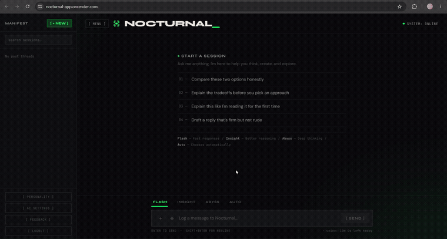
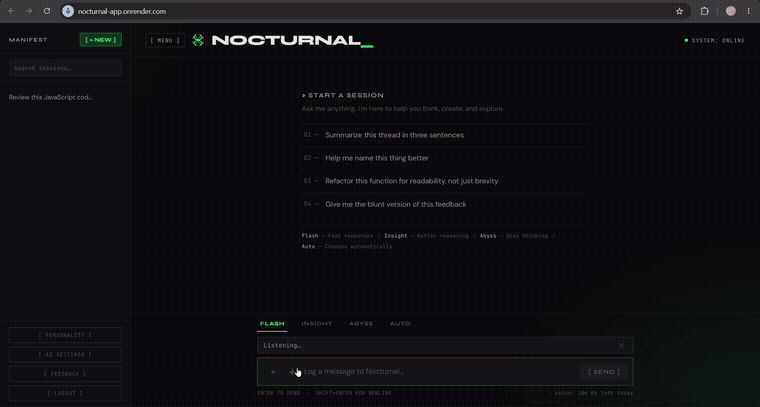
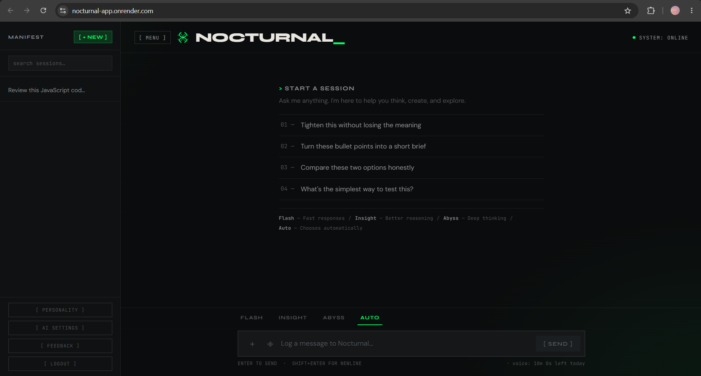
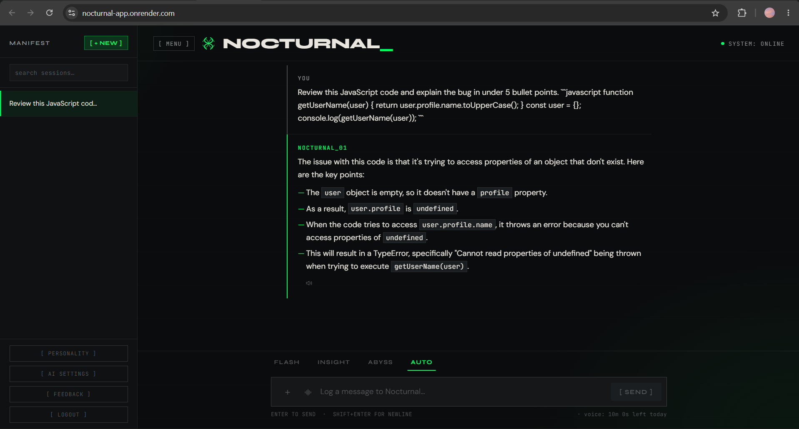
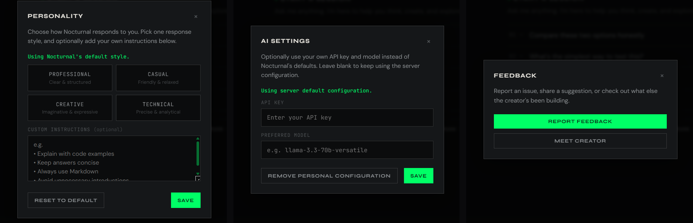

# Nocturnal AI

A full-stack, self-hosted AI chat application with per-user authentication, isolated chat history, live web search, voice input/output, and optional "bring your own key" (BYOK) support — built with Node.js, Express, Groq, Tavily, and Supabase.


**Live:**
- 🌐 Landing page — [nocturnal-app.vercel.app](https://nocturnal-app.vercel.app/)
- 💬 App / chat — [nocturnal-app.onrender.com](https://nocturnal-app.onrender.com/)



---

## 🚀 What's New in v2.0.0

Nocturnal can now tell when it needs to *know* something versus when it needs to *look something up* — and it handles the trivial stuff without spending a model call at all.

- **Intelligent capability planner** — every message is classified as `CHAT`, `SEARCH`, or `CLARIFY` before it ever reaches the main model, so Nocturnal only searches when live information would actually change the answer.
- **Live web search, powered by Tavily** — real-time results for current events, prices, scores, and anything else that goes stale, surfaced through a swappable search provider abstraction.
- **Live Search badge + expandable Sources panel** — when a response used live search, the UI shows it, with the underlying sources one click away.
- **Result caching with configurable TTL** — repeated or popular queries are served from cache instead of re-hitting the search provider, with per-category cache lifetimes.
- **Category-aware search routing** — the planner tags each query (sports, finance, weather, current affairs, etc.) so caching and result formatting can be tuned per topic.
- **Smarter follow-up resolution** — vague or pronoun-heavy follow-ups ("what about him?", "and now?") are rewritten into standalone, self-contained search queries using conversation context.
- **Relative-date reasoning** — the server's real clock is injected into both the planner and the main model as the single source of truth, so "today," "this year," and "latest" always resolve against the actual current date instead of stale training data.
- **Built-in local tools** — plain requests like *"what time is it"*, *"what's today's date"*, or *"what day is it"* are answered instantly by a local handler, with zero planner calls, zero search credits, and zero AI tokens spent.
- **Flash mode improvements** — faster, sharper short-form answers.
- **Full authentication overhaul** — email verification, a "Forgot password?" flow, and a more resilient sign-in experience end to end.
- **Secure account deletion** — deleting an account now cleans up all owned data (chat logs, voice usage, AI settings, personality preferences) explicitly, with cascading foreign keys as a database-level safety net.
- **Better session-aware responses** — the model draws more reliably on what's already been said in the conversation instead of re-asking or contradicting itself.
- **General reasoning improvements** across all modes.

---

## Highlights

- **Multi-model routing** — Flash / Insight / Abyss / Auto, switchable per message
- **Live web search** — planner-gated, Tavily-powered, cached, and cited with an expandable Sources panel
- **Local tools** — instant, AI-free answers for time/date-style requests
- **Full voice pipeline** — browser speech-to-text with a Groq Whisper fallback, and multilingual browser text-to-speech
- **Personality system** — response-style presets plus free-form custom instructions, applied server-side
- **BYOK** — bring your own API key and model, used in place of the server defaults
- **Hardened authentication** — email verification and password recovery on top of Supabase auth
- **Per-user data isolation** — Supabase Row Level Security on every chat session, with cascading cleanup on account deletion
- **Terminal-editorial UI** — dark, monospace, emerald-accented interface, fully responsive on mobile

---

## Landing Page

The landing page is a dark, "classified terminal" style aesthetic — black background, emerald/neon-green accents, monospace/technical typography — separate from the chat app itself and hosted independently on Vercel.

- **Hero section** — animated 3D bot model (Spline) centered over an emerald glow effect, with a glitch-style animated headline introducing Nocturnal.
- **Tagline / intro copy** — short pitch on what Nocturnal is and does, styled to match the terminal/HUD aesthetic.
- **Feature highlights** — scrollable sections calling out the app's core capabilities (multi-model AI routing, live search, chat history, secure auth, image understanding).
- **Call-to-action** — button(s) directing visitors into the live chat app.
- **Consistent theming** — the same emerald glow / dark palette carries through from the landing page into the chat app itself, so the transition feels like one product rather than two separately hosted pieces.

---

## Features (App)

- 🔐 **Authentication** — Supabase email/password auth with email verification, a "Forgot password?" recovery flow, session persistence, and an auth guard on every protected route.
- 🔒 **Per-user chat isolation** — every conversation is scoped to its owner via Row Level Security; no user can read, rename, or delete another user's sessions.
- 🧭 **Capability planner** — a fast routing model classifies each message as `CHAT` (answer directly), `SEARCH` (needs live information), or `CLARIFY` (too broad to search usefully) before the main model ever runs.
- 🔎 **Live web search** — Tavily-powered search for current events, prices, scores, and other time-sensitive queries, gated by the planner so it only fires when it's actually useful.
- 🏷️ **Category-aware routing & caching** — search queries are tagged by category (sports, finance, weather, current affairs, and more) and cached with a configurable TTL to cut down on redundant lookups.
- 🔗 **Live Search badge & Sources panel** — responses that used live search are visibly marked, with an expandable panel listing the underlying sources.
- 🗓️ **Relative-date reasoning** — the server's real current date is injected as ground truth into both the planner and the model, so relative expressions ("today," "this year," "latest") always resolve correctly.
- ⚡ **Local tools** — current time, current date, and current day are answered directly by a local handler, without invoking the planner, search, or the LLM.
- 💬 **AI chat with selectable modes**:
  - **Flash** — fast, short answers (also the vision-capable model, used automatically for image uploads)
  - **Insight** — balanced, code/technical-focused responses
  - **Abyss** — deep, deliberate reasoning for complex questions
  - **Auto** — picks Flash, Insight, or Abyss based on the content of your message
- 🎙️ **Voice input** — browser-native `SpeechRecognition` for live dictation, with a Groq Whisper fallback for uploaded audio clips or unsupported browsers. Usage is tracked against a daily voice quota.
- 🔊 **Voice output (TTS)** — browser `speechSynthesis`, entirely client-side. Picks the closest installed voice to the AI response's detected language (exact locale → same language family → browser default), and fails silently if nothing suitable is installed.
- 🎭 **Personality system** — choose a response-style preset (Professional, Casual, Creative, Technical) and optionally add custom instructions; applied server-side on every request.
- 🖼️ **Image upload with vision** — attach an image and ask questions about it.
- 📝 **Markdown + code blocks** — clean rendering with copyable code blocks.
- 🗂️ **Session management** — search, rename, delete, and revisit past conversations from the sidebar.
- 🔑 **Personal AI configuration (BYOK)** — optionally configure your own API key and model. When active, it's used for every request instead of Nocturnal's defaults, and image uploads are validated against known vision-capable models rather than silently falling back.
- 🗑️ **Secure account deletion** — permanently deletes a user's auth record along with all owned chat logs, voice usage, AI settings, and personality preferences, with cascading foreign keys as a database-level backstop.
- 💬 **In-app feedback** — a Feedback modal linking to a feedback form and the creator's portfolio.
- 🛡️ **Security hardening**
  - Helmet.js with a scoped Content Security Policy
  - Per-user (fallback per-IP) rate limiting on AI and voice requests
  - Input validation (message length, image size/type)
  - Environment-aware CORS allowlist
  - Request timeouts with graceful upstream-failure handling
  - Personal API keys encrypted at rest (AES-256-GCM)

---

## Search & Reasoning Pipeline

Nocturnal doesn't send every message straight to the model. Instead, each request first passes through a lightweight routing layer:

1. **Local tools** — plain time/date requests are answered immediately, with no AI call at all.
2. **Planner** — a small, fast model classifies the message as `CHAT`, `SEARCH`, or `CLARIFY` based on whether it needs live information, is already answerable, or is too vague to search well.
3. **Search (when routed)** — the resolved, standalone query is checked against the cache; on a miss, it's sent to the configured search provider (Tavily by default) and the result is cached for future requests.
4. **Response generation** — the main model (Flash/Insight/Abyss) answers using conversation context, any injected search results and sources, and the server's authoritative current date.

This keeps search fast and cheap (cache-first, category-aware TTLs), keeps answers grounded in the actual current date rather than training data, and keeps the search provider itself swappable without touching the rest of the pipeline.

---

## Voice Features

Voice input and output are both handled entirely in the browser where possible, with a server-side fallback only for transcription:

- **Speech-to-text** — `SpeechRecognition` runs live in supported browsers; audio clip uploads or unsupported browsers fall back to Groq Whisper transcription.
- **Text-to-speech** — `speechSynthesis.getVoices()` only, no external APIs. Detects the response's language and prefers an exact-locale voice, then same language family, then the browser default.
- **Playback state** — only one message can be speaking at a time; the speaker icon animates while active and returns to idle when playback finishes or is cancelled.
- **Voice quota** — daily voice usage is tracked per user and shown in the input bar.



---

## Screenshots

<table>
<tr>
<td width="50%">

**Empty state**


</td>
<td width="50%">

**Chat interface**


</td>
</tr>
</table>

**Customization — Personality, AI Settings, Feedback**


---

## Tech Stack

| Layer | Technology |
|---|---|
| Frontend | HTML, CSS, vanilla JavaScript |
| Backend | Node.js, Express 5 |
| AI Inference | [Groq](https://groq.com) (Llama 4 Scout, Llama 3.3 70B, Qwen3 32B) |
| Live Search | [Tavily](https://tavily.com), behind a swappable search provider abstraction |
| Auth & Database | [Supabase](https://supabase.com) (Postgres + Auth, with Row Level Security) |
| Voice | Browser SpeechRecognition + speechSynthesis, Groq Whisper (fallback transcription) |
| File uploads | Multer (in-memory, image/audio) |
| Security | Helmet, express-rate-limit, AES-256-GCM (key encryption) |

---

## Architecture Overview

- **Client** (`public/`) — static HTML/CSS/vanilla JS, no build step. `script.js` drives chat, voice, and session UI; `settings.js`, `personality.js`, `feedback.js`, and `account.js` each own a single modal or flow and talk to their own API routes.
- **Server** (`server.js`) — a single Express app exposing chat, voice, session, and settings routes behind an auth middleware that verifies the Supabase session token — and email verification status — on every request.
- **Routing pipeline** — every chat message flows through local tools, then the planner, before it reaches the model:

  ```
  User
    ↓
  Local Tools     (instant answers: time / date / day — no AI, no search)
    ↓
  Planner         (routes to CHAT / SEARCH / CLARIFY)
    ↓
  CHAT / SEARCH / CLARIFY
    ↓
  Groq + Tavily   (model response, optionally grounded in live search results)
    ↓
  Response
  ```

- **AI pipeline** — mode (Flash/Insight/Abyss/Auto) and personality are resolved server-side per request, live search context is injected when the planner routes to `SEARCH`, and BYOK users' personal key/model are decrypted and substituted in place of the server defaults.
- **Search layer** (`lib/search/`) — a provider abstraction (`index.js`) sits in front of the active provider (`tavily.js`), with shared result caching (`cache.js`) and context formatting (`formatContext.js`) that stay provider-agnostic.
- **Database** — Supabase Postgres holds chat logs, voice usage, AI settings, and personality preferences, all scoped by `user_id`, enforced with Row Level Security, and cleaned up automatically on account deletion via cascading foreign keys.

---

## Getting Started

### Prerequisites

- Node.js 18+
- A [Supabase](https://supabase.com) project
- A [Groq](https://console.groq.com) API key
- A [Tavily](https://tavily.com) API key (for live search)

### 1. Clone and install

```bash
git clone https://github.com/<your-username>/nocturnal-ai.git
cd nocturnal-ai
npm install
```

### 2. Configure environment variables

Copy the example file and fill in your own values:

```bash
cp .env.example .env
```

| Variable | Required | Description |
|---|---|---|
| `PORT` | No (defaults to 3000) | Port the server runs on |
| `GROQ_API_KEY` | Yes | Your Groq API key (server default, used when a user has no personal config) |
| `SUPABASE_URL` | Yes | Your Supabase project URL |
| `SUPABASE_SERVICE_ROLE_KEY` | Yes | Supabase service role key (server-side only — **never expose this to the browser**) |
| `SUPABASE_ANON_KEY` | Yes | Supabase anon/public key (safe for the browser) |
| `NODE_ENV` | No | Set to `production` when deploying |
| `FRONTEND_URL` | Only in production | Your deployed frontend's exact origin, used for the CORS allowlist |
| `SETTINGS_ENCRYPTION_KEY` | Yes | Long random secret used to encrypt personal API keys at rest. Generate one with `openssl rand -hex 32` |
| `TAVILY_API_KEY` | Yes | API key for the Tavily search provider, used by the planner's `SEARCH` route |
| `SEARCH_PROVIDER` | No (defaults to `tavily`) | Which search provider to use behind the search abstraction |
| `SEARCH_CACHE_TTL_MS` | No | Default cache lifetime (in ms) for search results; individual categories may override this |

### 3. Set up the database

Run the migrations in `migrations/` against your Supabase project, **in order**, via the Supabase SQL editor:

1. `001_add_user_id_to_chat_logs.sql` — adds per-user ownership to chat history
2. `002_enable_rls_chat_logs.sql` — enables Row Level Security (run only after confirming the app works correctly with #1)
3. `003_add_voice_usage.sql` — creates the table for daily voice quota tracking
4. `004_add_ai_settings.sql` — creates the table for personal AI (BYOK) configuration
5. `005_add_user_personality.sql` — creates the table for personality presets and custom instructions
6. `006_account_deletion_cascade.sql` — adds cascading foreign keys so a user's data is cleaned up automatically if their account is ever removed outside the app's own deletion flow

### 4. Run the app

```bash
npm start
```

Visit `http://localhost:3000`.

---

## Project Structure

```
nocturnal-ai/
├── server.js                 # Express server, API routes, planner/search pipeline, auth/security middleware
├── lib/
│   ├── planner.js             # Capability planner — routes each message to CHAT / SEARCH / CLARIFY
│   ├── localTools.js          # Local, AI-free handlers (current time / date / day)
│   └── search/
│       ├── index.js            # Search provider abstraction
│       ├── tavily.js           # Tavily search provider implementation
│       ├── cache.js            # Search result caching with per-category TTL
│       └── formatContext.js    # Formats search results into model-ready context
├── migrations/                # SQL migrations (run in order against Supabase)
├── public/
│   ├── index.html             # Main chat interface
│   ├── auth.html               # Login / signup page
│   ├── reset-password.html     # Password recovery page
│   ├── auth-guard.js           # Client-side session check (redirects unauthenticated users)
│   ├── auth.js                  # Login / signup / forgot-password / email verification logic
│   ├── reset-password.js        # Password reset flow logic
│   ├── script.js                # Chat, voice, and session UI logic
│   ├── settings.js              # Personal AI (BYOK) settings modal
│   ├── personality.js           # Personality (response style) modal
│   ├── feedback.js              # Feedback modal
│   ├── account.js               # Account management / secure account deletion
│   └── style.css                 # App styling
├── .env.example
└── package.json
```

---

## Security Notes

- Never commit your `.env` file — it contains live secrets. It's excluded via `.gitignore`.
- The Supabase **service role key** bypasses Row Level Security and must only ever be used server-side (as it is here).
- Personal API keys submitted via the BYOK settings are encrypted before being stored and are never returned in any API response or logged in plaintext.
- Email verification is enforced server-side — unverified accounts cannot use the chat pipeline, not just the client UI.
- Account deletion removes a user's data explicitly across every owned table, with cascading foreign keys as a database-level safety net against orphaned rows.
- Rate limits are tuned for demo/personal use, not high-traffic production load — adjust the relevant limiters in `server.js` if deploying more broadly.

---

## Deployment

This project is deployed as two separate services:
- **Landing page** → Vercel (static frontend)
- **Chat app + API** → Render (Node/Express server)

Because these are on different domains, `FRONTEND_URL` on the Render service must be set to the exact Vercel origin so the CORS allowlist accepts requests from the landing page in production.

## Roadmap

- [ ] Expanded deployment/production guide
- [ ] Spend tracking per user
- [ ] Migrate stored images from base64 to Supabase Storage
- [ ] Additional local tools (calculator, UUID/hash generation, timestamp conversion)
- [ ] Secondary/fallback search provider support

---

## Creator

Designed and engineered by Wizz.

Portfolio: [https://wizzbot-offi.vercel.app/](https://wizzbot-offi.vercel.app/)

## License

ISC
